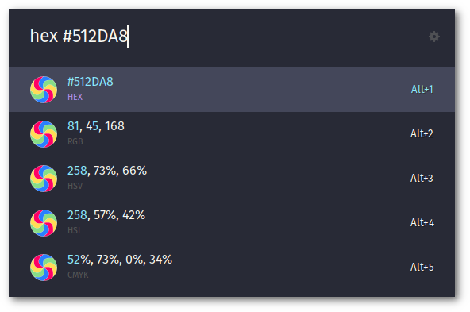
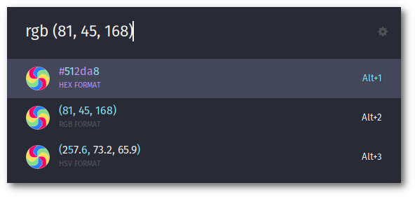
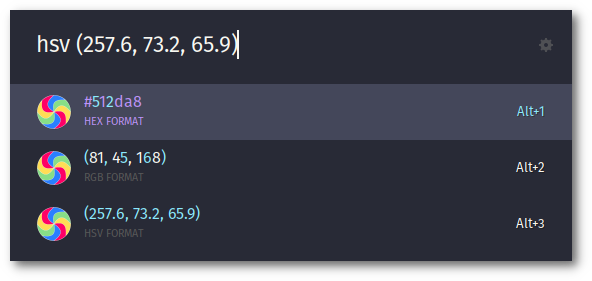

  

<h1 align="center">Color Converter</h1>

----------

This is an extension for [ULauncher](https://ulauncher.io/), it helps you to convert color codes in multiple formats

|  |  |
|-----------------------------|-----------------------------|
|  |

## Options

The options are the format that you want to convert
* hex > Hexadecimal 
* rgb > RGB
* hsv > HSV

See the screenshots for examples

You can get the code to your clipboard, just select and pressing enter!

> **IMPORTANT!** Please, don't change the default keywords.
>
> **For the moment** the code has them hardcoded, so the extension cant work if you change it.

----------

If you like my work you can

