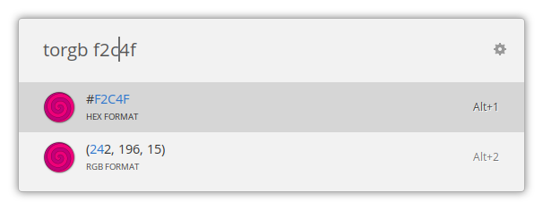

  

<h1 align="center">Color Converter</h1>

----------

This is an extension for [ULauncher](https://ulauncher.io/), it helps you to convert RGB <> HEX color codes

|  |  |
|-------------------------------|-------------------------------|

----------

## Options

* tohex > Convert to Hex
* torgb > Convert to RGB

You can get the code to your clipboard, just select pressing enter!

> **IMPORTANT!** Please, don't change the default keywords.
>
> **For the moment** the code has them hardcoded, so the extension cant work if you change it.
